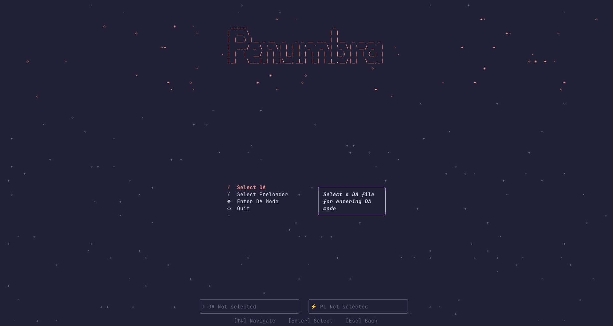

# 🌘 Penumbra

Penumbra is a Rust crate and tool for interacting with Mediatek devices.<br>
It provides flashing and readback capabilities, as well as bootloader unlocking and relocking on vulnerable devices.<br>

<h1  align="center">

</h1>

## Requirements

* On Windows, you'll need to install Mediatek Drivers.
* On Linux you'll need to install `libudev` and add your user to the `dialout` group.

## Usage

Penumbra can be used both as a crate for interacting directly with a device with your own code, as well as providing a (preliminary) [TUI](tui).

For using the crate, use the device API:

```rs
use std::fs::File;

use anyhow::Result;
use env_logger::Builder;
use penumbra::{Device, DeviceBuilder, find_mtk_port};
use tokio::io::{AsyncWriteExt, BufWriter};

#[tokio::main]
async fn main() -> Result<()> {
    env_logger::init();
    let da_path = std::path::Path::new("../DA_penangf.bin");
    let da_data = std::fs::read(da_path).expect("Failed to read DA file");

    println!("Searching for MTK port...");
    let mtk_port = loop {
        if let Some(port) = find_mtk_port().await {
            break port;
        }
    }

    println!("Found MTK port: {}", mtk_port.get_port_name());
    
    let mut device = DeviceBuilder::default()
        .with_mtk_port(mtk_port)
        .with_da_data(da_data)
        .build()?
    
    // Init the device (Handshake and populate dev info)
    dev.init().await?;
    
    let tgt_cfg = dev.dev_info.target_config().await;
    println!("SBC: {}", (tgt_cfg & 0x1) != 0);
    
    // This will enter DA mode. Seccfg unlock only works if the device can load extensions / is vulnerable
    device.set_seccfg_lock_state(LockFlag::Unlock).await

    // Ignore progress for now
    let mut progress = |_read: usize, _total: usize| {};

    let file = File::create("lk_a.bin").await?;
    let mut writer = BufWriter::new(file);

    let mut lk_a_data = device.read_partition("lk_a", &mut progress, &mut writer).await;
    
    writer.flush().await?;
    
    Ok(())
}
```

For using the TUI, first run the executable, then:
* Navigate using the UP and DOWN arrows
* Select the DA in the home page pressing Enter, and select the appropriate file
* After selecting the DA, go on `Enter DA mode` and press `Enter`
* Now connect the device
* Enjoy!

### Debug logs

Penumbra is still in early development, thus it can break quite easily.
If so, you can open an issue attaching debug logs.<br>
To get debug logs, run `antumbra` with the `-v` flag. A file called `antumbra.log` will be created in the current directory.

Note: Penumbra currently supports both V5 (XFlash) and V6 (XML) devices. Issues reporting incompatibility with other chipset will be ignored until broader support is added.

## Contributing

For contributing, you'll first need to setup a development environment.

If you use Nix, you can just run `nix develop` to enter the development shell.<br>
On any other distribution, you'll need to install the following dependencies:

* libudev-dev
* Rust toolchain
* Rust analyzer
* rustfmt
* glib
* pkg-config
* systemd-dev

### Current Roadmap

Core:
* [x] Add UFS support
* [x] Dynamically determine SEJ base (for more chipsets support)
* [x] Build DA extensions from source
* [ ] Limit extensions only commands when exts are not added to avoid timeouts
* [x] Add a way to restore state
* [x] Clean up duplicated code
* [x] Add support for BROM mode (and setup DRAM)
* [ ] Add support for DA SLA and preloader auth
* [x] Add target config to Device Info (SBC, DAA and SLA)
* [x] Improve support for preloader/brom only connection (for testing purposes with just preloader commands)
* [x] Improve DA parsing and add DA patching

TUI:
* [ ] Add partition read and write (Add partition list next to the action list)
* [ ] Make code reusable (add components like a custom FileExplorer, selectable list...)
* [ ] Change logo with an animated waning crescent moon with blinking stars around
* [ ] Add a switch on the welcome screen to enable or disable logging (with selection for log level)

Scripts:
* [ ] Parse sec policy from both preloader and lk (find a good seclib pattern)

Documentation:
* [ ] Document XFlash protocol
* [ ] Improve Carbonara information

## Learning Resources

Penumbra has [its own documentation](https://shomy.is-a.dev/penumbra), where you can learn more about Mediatek devices and how the Download protocol works.

Other learning resources I suggest are the following
* [mtkclient](https://github.com/bkerler/mtkclient)
* [moto-experiments](https://github.com/R0rt1z2/moto-experiments)
* [kaeru](https://github.com/R0rt1z2/kaeru)
* [Carbonara exploit](https://shomy.is-a.dev/penumbra/Mediatek/Exploits/Carbonara)
* [mtk-payloads](https://github.com/shomykohai/mtk-payloads)

## License

Penumbra is licensed under the GNU Affero General Public License v3 or later (AGPL-3.0-or-later), see [LICENSE](LICENSE) for details.

Part of the code in Penumbra is adapted from [mtkclient](https://github.com/bkerler/mtkclient). The code adapted from mtkclient is licensed
under the GNU Public License v3 or later (GPL-3.0).

As for term 13 of the GPL-3.0 license, the GPL-3.0 components must comply the networking terms of the AGPL-3.0 license when used together.
